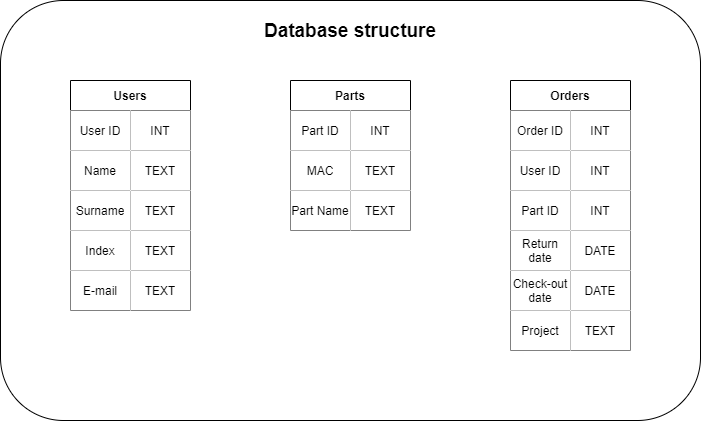

# RFID logger
## Description
Our main goal is to make system which could help us with stocktaking. We're going to do it using RFID 13.56MHz tags, and device to read it. Device will be connected with our database and app. We consider sharing our system with student research groups at our university. It will be very helpful for them because of possibility of renting tools and devices without many documents.

## Used devices
We're going to build main device on raspberry pi 4. It gives us a lot of computing power and direct connection to AGH's network with cable. We consider to use PN532 RFID module to make our project cheaper and more flexible.

## Instalation of our system
### PN532 on Raspberry Pi 4
  
  
#### Connection with SPI
| PN532 module | Raspberry |
|:------------:|:---------:|
|     VCC      |    3.3V   |
|     GND      |    GND    |
|     MOSI     |    MOSI   |
|     MISO     |    MISO   |
|     SS       |    CE0    |
|     SCK      |    SCLK   |

**Don't forget to switch switches to 0 1 position!**

## Database 

## Temporary part of read me :  
### Aplication futures - TODO  
Legend:  
get means get from user   
return mainly mean return from database  
set set to database  
#### Scanning  
- [ ] Scanning - RFID -> returns MAC in string format  
- [ ] Find returned MAC in database -> return part_id, part_name, return_date, user_ID, status + ?name/email(RODO)
    - [ ] If not in base print "Add button " -> get part_name (?get status or set available by default?) -> save into database 
    - [ ] If in the database -> print on screen returned information -?(part_name, return_date, user_ID + ?name/email(RODO))   
        -> 2 buttons "Add to database", ("Rent/? Check-out"(if status == available) OR "Return"(if status == NotReturned))   
        - [ ] Add to database": get part_name -> add to database   
        - [ ] Rent/? Check-out": get ?e-mail -> return coresponding user_ID    
            - if 404 print "User not found" + "Register button"   
            - If found -> get check-out_date, return_date, project? -> save into database in Order, change Status to NotReturned   
        - [ ] "Return" : (get ?actual date) OR (get it from Internet)  -> set date into return_date, set available=returned, set status=available     
            

### GUI and base menagment   it totally depends of time that we have      
- [ ] Delete Orders' history after year/ half of year ???  
- [ ] Register fuction()/ add user(): get name, surname, index, e-mail -> save in database 
- [ ] Look into base() - filtering and sorting database
    - [ ] filter by partname: get part_name -> return (status, part_name, and user and order information  ?????)
    - [ ] filter by status:  same as above
    - [ ] find user and its order history: get ??? - > return sorted orders  
    - [ ] filter by project ???? -> return notreturned yet OR???? order history
    - [ ] ???????????
    - [ ] sort by name
    - [ ] sort by return date
    - [ ] ???????????????
- [ ] if we need edit user/part data function eg. edit email() ????
- [ ] ??????????????????

## Skills 
- mySQL 
- Python
  - mySQL in Python 
  - Kivy library for user interface

## Milestones
- **20.12.2020** - Read tags and write or delete them from .txt file;
- **03.01.2020** - First version of app and database
- **17.01.2020** - Ready project. App with GUI, connected with database
