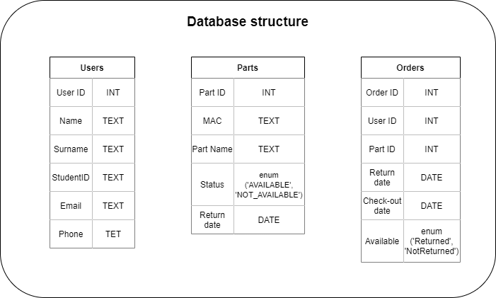

# RFID logger
## Authors:
@MatKozyra52  
@sajdak.radoslaw
## Description
Our main goal is to make system which could help us with stocktaking. We're going to do it using RFID 13.56MHz tags and device to read it. Device will be connected with our database and app. We consider sharing our system with student research groups at our university. It will be very helpful for them because of possibility of renting tools and devices without many documents.

## Used components
We're going to build main device on raspberry pi 4. It gives us a lot of computing power and direct connection to AGH's network with cable. 

| PN532 module | Raspberry |
|:------------:|:---------:|
|     VCC      |    3.3V   |
|     GND      |    GND    |
|     MOSI     |    MOSI   |
|     MISO     |    MISO   |
|     SS       |    CE0    |
|     SCK      |    SCLK   |

**Don't forget to switch switches to 0 1 position!**

## Automatic software installation
You should install raspbian with desktop from [PRODUCENT SITE](https://www.raspberrypi.org/software/)  
We **highly recommend** you to use RaspberryPi imager. That is the easiest way for the new users.

After that, you have to enable SSH and add raspbery to your network. You can use this tutorial: [Tutorial](https://www.raspberrypi-spy.co.uk/2017/04/manually-setting-up-pi-wifi-using-wpa_supplicant-conf/)  
**If you don't have Wi-Fi connection** just plug-in your ethernet cable to your raspberry after enabling ssh.

First You should download our shell code (Logger_install.sh). You can send it to your raspberry with SCP:  
 - _scp user/Desktop/Logger_install.sh pi@192.168.0.155:~/._

The next step is set it's privilages with:  
 - _sudo chmod 777_ Logger_install.sh .
  
After that you should **Manually** set VNC. **!!!Warning!!!** Raspberry will reboot automatically after finished next step. Then VNC will work.
 - _sudo raspi-config_ -> _Interfacing options_ -> _VNC_ -> _Yes_

The next step is to run out script with  
 - _\./Logger_install.sh_

Finally you can connect to raspberry with VNC client and use our app.  
 - _python3 rfid-logger/Main.py_
## Database 
We're using MySQL database from [remotemysql.com](https://remotemysql.com/) site. You can use any other database with SQL commands. Don't forget to change domain and others in [const.py](const.py) file!!!  

## Application
Frontend of our app was made with Kivy - cross platform Python framework. Core of app, database and RFID was written in python. 

### Milestones
- **20.12.2020** - Read tags and write or delete them from .txt file;
- **03.01.2020** - First version of app and database
- **17.01.2020** - Ready project. App with GUI, connected with database
